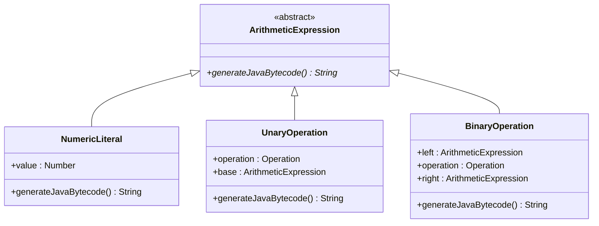
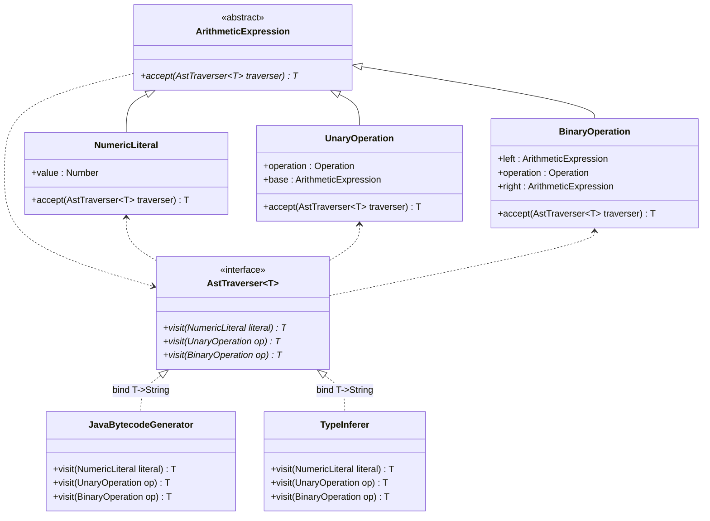
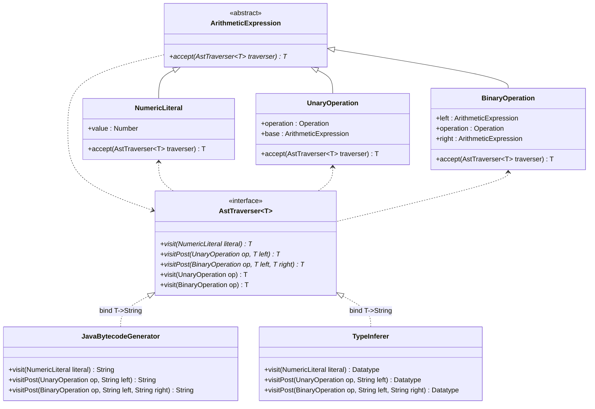

# KA-TINF20B1: solving the double dispatch problem

> 📝 **Please Note:** This repository is part of a lecture series on compiler construction at the [Baden-Württemberg Cooperative State University Karlsruhe](https://www.karlsruhe.dhbw.de/en/general/about-dhbw-karlsruhe.html) in Germany. Special to this university are the career-integrated undergraduate study programs. In alternating three-month phases, students learn theory at the university and receive practical training from an enterprise. The students have an employment contract, and throughout the entire period, they receive a monthly salary and have the insurance status of employees. For a listing of lecture content, see section T3INF4211 in the [university's module handbook](https://www.dhbw.de/fileadmin/user/public/SP/KA/Informatik/Informatik.pdf).

Typically, my lectures include regular challenges that my students are expected to solve at home as part of their independent study. This repo is therefore intentionally incomplete and based on the solution of a previous assignment. So please don't be surprised if the project already contains errors right after cloning. It relies on a Lexer that emerges from project [tinf20b1-thompsons-construction](https://github.com/caput-lectoris/tinf20b1-thompsons-construction) once you implement a basic regular expression parser. These and many other dependencies are handled by the build management tool Apache Maven. When a Maven build is executed, Maven automatically downloads all necessary Java archives (*.jar) into the local repository. However, the previous challenge is not included in the central Maven repository and thus cannot be downloaded. So you actually have to solve the previous project and copy the resulting jar-file to your local Maven repository using the target "Maven Install".

## status quo

The given top-down parser [`ArithmeticParser`](https://github.com/caput-lectoris/tinf20b1-demo-double-dispatch/blob/main/src/main/java/de/dhbw/caput/tinf20b1/ll1/ArithmeticParser.java) generates abstract syntax trees for simple arithmetic expressions consisting of the four basic arithmetic operations plus, minus, times, divided, as well as a power operation. The tree consists of nodes representing literals, unary and binary operations. They all derive from the abstract class `ArithmeticExpression`. A simplified class diagram is shown below. Click on the classes to jump to their implementation.



Superclass `ArithmeticExpression` has an abstract method that all derived classes must implement. As the name suggests, it is used to generate Java bytecode. In the lecture we have already found out that the tree must be traversed in postorder. That is, we first generate the code for all child nodes from left to right and finally append the instruction for the current node. This results in the following implementation for class `BinaryOperation`.

```java
public class BinaryOperation extends ArithmeticExpression {

  public final ArithmeticExpression LEFT, RIGHT;
  public final Operation OPERATION;

  @Override
  public String generateJavaBytecode( ){
    String left = LEFT.generateJavaBytecode( );
    String right = RIGHT.generateJavaBytecode( );
    return String.format( "%s%n%s%n%s", left, right, OPERATION.INSTRUCTION );
  }

}
```

## adding new transformations

[Java bytecode](https://docs.oracle.com/javase/specs/jvms/se18/html/jvms-6.html) is typed. For example, there are four different instructions for addition: `iadd`, `ladd`, `fadd`, and `dadd`. These mnemonics represent the addition of integer, long, floating point, and double precision numbers in that order. Of course, we could restrict ourselves to processing only integers. However, this is a rather hard restriction, and our programming language would probably never find wide application. Instead, one could also consider all numbers as double precision floating point numbers, but then some real numbers could not be represented precisely. As we can see, we can't avoid choosing the right JVM instruction.

Assuming we want to add an integer and a float, we would need to use the instruction `fadd`. So obviously there are more dominant and less dominant types. Of course, the integer must be converted to a float beforehand, but whether we cast implicitly or explicitly can be decided later. In any case, we have to determine the type of addition. Let's add another abstract method `inferTypes()` to our superclass.

### (polymorphic) open/closed principle

Oh dear, it's broken! All derived classes have compile errors! Sure they have, you might say. The method must be implemented in all these subclasses. That's true, no objection. What outrages me is that we just witnessed a violation of the [(polymorphic) open/closed principle](https://clean-code-developer.com/grades/grade-4-green/#Open_Closed_Principle). The open what? Let me explain: The term is commonly attributed to Betrand Meyer and relates two main characteristics of software in general: reuse and changeability. Reuse manifests itself in subroutines, functions, methods, libraries, and much more. Changeability, on the other hand, is in the concept of software itself. I mean, if it wasn't changeable, it would be hardware, right? In his 1988 book Object-oriented Software Construction, Betrand Meyer described the relationship between the two properties:

> Software entities (classes, modules, functions, etc.) should be open for extension, but closed for modification. A module will be said to be open if it is still available for extension. For example, it should be possible to add fields to the data structures it contains, or new elements to the set of functions it performs. A module will be said to be closed if [it] is available for use by other modules. This assumes that the module has been given a well-defined, stable description (the interface in the sense of information hiding).

In particular, it bothered Meyer that adding new fields or functions to a library requires adjusting all programs depending on that library. Users cannot be expected to constantly change their code as interfaces change. Interfaces must be stable. This is a crucial requirement for reusability. At the same time, he demands one should write his code in such a way that it is extensible. How is this supposed to work? How do you extend an entity that you are not allowed to change? Meyer suggested using implementation inheritance to achieve this goal:

> A class is closed, since it may be compiled, stored in a library, baselined, and used by client classes. But it is also open, since any new class may use it as parent, adding new features. When a descendant class is defined, there is no need to change the original or to disturb its clients.

Today we know that one should generally [favor composition over inheritance](https://clean-code-developer.com/grades/grade-1-red/#Favour_Composition_over_Inheritance_FCoI). This is because inheritance (whitebox reuse) often introduces strong coupling into the program. If you still choose inheritance, you must satisfy the [Liskov substitution principle](https://clean-code-developer.com/grades/grade-3-yellow/#Liskov_Substitution_Principle). The objective is ingenious, only the recommended solution needs improvement. Luckily, some people have dealt with this problem before us. During the 1990s, Robert C. Martin and others popularly redefined the open/closed principle to the polymorphic open/closed principle. Instead of superclasses, it advocates the use of abstracted interfaces to allow different implementations which you can polymorphically substitute for each other. The interface is closed for modifications, but you can still extend it with a class implementing that interface.

### introducing a new interface

Well, if adding more transformations to base class `ArithmeticExpression` violates the open/closed principle, maybe we should actually try an interface? Since we need to generate different bytecode for each node, we will also need a separate method per node. Programming languages distinguish methods by their signature. In Java, the signature consists only of the method name as well as the number, type, and order of the parameters. We have to specify at least one parameter anyway, namely the node for which we want to generate code. In this respect, the interface definition is already finished. The only thing missing, like so often, are the method and class names...

Both to infer the types and to generate gapless bytecode, the tree must be traversed completely. Consequently, our interface must be called once for each individual node. In a more colloquial way, one would perhaps say that it visits every element. That's why I tend to call the methods `visit`. After we have "visited" each node, we have completely traversed the abstract syntax tree. So how about naming our interface `AstTraverser`? Let's briefly capture these findings in code:

```java
public interface AstTraverser<T> {

  public T visit( NumericLiteral literal );
  public T visit( UnaryOperation op );
  public T visit( BinaryOperation op );

}
```

As you can see I have introduced a generic return type. This is because the bytecode generator is supposed to return a string, while the type inferer should return a data type. That's all. Nevertheless, the implementation of the bytecode generator still causes problems: Before we generate the instruction for a unary operator, code must be generated for the underlying expression. That means we have to call the visit method for the child nodes within the current visit method. Only this way the traversal succeeds. However, this causes a compiler error. I have marked the place in the source code with a comment.

```java
public class JavaBytecodeGenerator implements AstTraverser<String> {

  @Override
  public String visit( NumericLiteral literal ){
    return String.format( "bipush %s", literal.VALUE );
  }

  @Override
  public String visit( UnaryOperation op ){
    String base = visit( op.BASE ); //!!! COMPILE ERROR !!!
    return String.format( "%s%n%s", base, op.OPERATION.INSTRUCTION );
  }

  @Override
  public String visit( BinaryOperation op ){
    // TODO Auto-generated method stub
    return null;
  }

}
```

The type of `op.BASE` is an `ArithmeticExpression` according to the class diagram above. However, the `AstTraverser` only provides methods with the subclasses as parameters. Mmh, isn't that what polymorphism is all about? No, it's not. Java doesn't support polymorphism on the arguments. Have I misled you? I guess the concepts aren't as easy as they seemed at first glance, are they? Don't worry, it's a very common mistake and I will of course clear it up.

**Polymorphism** derives from the Greek words "poly" and "morphs", which means something like "innumerable/many forms". The term is used in various scientific disciplines. In computer science, this refers to the ability to use the same interface for objects of different data types. Despite the common interface, all types may have their own independent implementation. Java knows two distinct forms of polymorphism.

**Static/compile-time polymorphism** enables you to define multiple methods in one class, all having the same name, but a different set of parameter types as well as their own independent implementation. In Java, we usually call this **method overloading** and we have even applied this concept to the `AstTraverser`. The decisive clue is provided by the term "compile-time". Due to the different sets of parameters, each method has a unique signature. From this signature the compiler recognizes which method is to be called and binds it statically to the proper method call. `op.BASE` is obviously an `ArithmeticExpression`. However, there is no `visit` method for this type. That's what the compiler error tells us. The fact that it is a non-instantiable class, indicating that only concrete subclasses appear at runtime, is irrelevant. **Static binding** means there is no distinction at runtime.

**Dynamic/runtime polymorphism** enables you to redefine instance methods in a child class that are already provided by one of its parent classes. Both methods, the original and the redefined, share the same name and the same parameters. We therefore usually call it **method overriding**. In this case, the compiler has no chance to determine the method to be executed. It is the task of the JVM to select the correct implementation based on the runtime type. We have already used this concept before, again with the `visit` method. It becomes more obvious when we were to write `this.visit( op.BASE )`. After all, we are not calling it on `AstTraverser`, but on `JavaBytecodeGenerator`.

You see, method overloading and method overriding are two separate concepts. Do not confuse them. Only the runtime type of the object on which we call a method affects method resolution, but not the runtime types of the parameters. This is why method resolution in Java is also called **single dispatch**, because it depends on only one object's runtime type. What we need here is a **double dispatch**, but this is not supported, as we've just learned.

### emulating double dispatch

Luckily, we can emulate multiple dispatch via a chain of single dispatch calls. For this we need to look again at the last code listing. If the instruction pointer sits on line 10 at the compile error, we already know that we are in the bytecode generator. What we don't know is the runtime type of `op.BASE`. Therefore, it makes no sense to bind the known type dynamically and the unknown type statically. Let's just swap the types. Instead of `visit( op.BASE )`, we write `op.BASE.accept( this )`. We now end up in a fictitious `accept` method of the concrete subclass. Can we finally call the visit method now? Sure we can! We have received the bytecode generator in the form of a parameter and we are already in the concrete child node. The method call `traverser.visit( this )` should fix it. This results in the following method definition.

```java
@Override
public <T> T accept( AstTraverser<T> traverser ){
  return traverser.visit( this );
}
```

Of course, this new helper method must be implemented in each subclass. Moreover, `op.BASE` is still of type `ArithmeticExpression`. Thus, to satisfy the compiler we must define `accept` as an abstract method in the base class and implement it in all subclasses. The resulting class diagram is shown below.



Did you notice that we have just implemented the **visitor design pattern**? It is one of 23 design patterns (category: behavioral patterns) described and published in 1994 by four computer scientists who commonly refer to themselves as the "Gang of Four". The visitor design pattern is used to encapsulate operations, that is, to separate the algorithm from the object structure. This encapsulation makes it possible to add new operations to existing object structures without changing the affected element classes.

The visitor design pattern is implemented as follows: We consider two abstracted classes/interfaces; one is referred to as the **element**, and the other as **visitor**. Both classes/interfaces are embedded in a type hierarchy and may have derived child classes. Child classes of the element are called **concrete elements**. Child classes of the visitor are **concrete visitors**. At runtime, objects appear only as concrete elements and concrete visitors. The abstract visitor (in our case the `AstTraverser`) declares a `visit` method for each concrete element with a parameter of exactly that type. As we have learned, this is a static method overload. All these visit methods are implemented by the concrete visitors and each of the methods describes only a part of the algorithm. It is exactly the part that deals with the concrete element they operate on. The abstract element (in our case the `ArithmeticExpression`) declares an `accept` method, which in turn takes a visitor as an argument. The accept method must also be implemented in all derived concrete elements. However, this is usually no more than a call to the visitor's visit method.

<!-- requires language that supports single dispatch. -->

### taking advantage of default methods

The current solution is already very good. No doubt about it. Also, the logic for code generation or type inference is no longer distributed over several classes, but is compactly located in just one implementation of the visitor. That's brilliant! Nevertheless, we have again violated an important principle. Do you know which one?

Well, the traversal logic is actually identical for all concrete visitors, but we have to implement them anew for each derived class. This creates redundancy which fosters inconsistencies and mistakes. The violated principle is just an imperative, which emphasizes its importance. It's [don't repeat yourself](https://clean-code-developer.com/grades/grade-1-red/#Don8217t_Repeat_Yourself_DRY) or DRY for short. Fortunately, this issue can be solved quickly with some default implementations. This is not rocket science. Therefore I did the modification without further explanation. You can see the result in the code listing below.

```java
public interface AstTraverser<T> {

  public T visit( NumericLiteral literal );

  public default T visit( UnaryOperation op ){
    T base = op.BASE.accept( this );
    return visitPost( op, base );
  }
  public T visitPost( UnaryOperation op, T left );

  public default T visit( BinaryOperation op ){
    T left = op.LEFT.accept( this );
    T right = op.RIGHT.accept( this );
    return visitPost( op, left, right );
  }
  public T visitPost( BinaryOperation op, T left, T right );

}
```

All things considered, we end our design with this class diagram.



## Your Task

In the lecture we had only converted the `generateJavaBytecode` method to a concrete visitor. The conversion of the type inference is still to come. As a preparatory measure, I have already created a class of type `TypeInferer`. Please fill the auto-generated methods with content so that the tests pass successfully.

```java
public class TypeInferer implements AstTraverser<Datatype> {
  public static void runOn( ArithmeticExpression expression ){
    TypeInferer inferer = new TypeInferer();
    expression.accept( inferer );
  }
  @Override
  public Datatype visit( NumericLiteral op ){
    // TODO Auto-generated method stub
    return null;
  }
  @Override
  public Datatype visitPost( UnaryOperation binOp, Datatype left ){
    // TODO Auto-generated method stub
    return null;
  }
  @Override
  public Datatype visitPost( BinaryOperation op, Datatype left, Datatype right ){
    // TODO Auto-generated method stub
    return null;
  }
}
```
